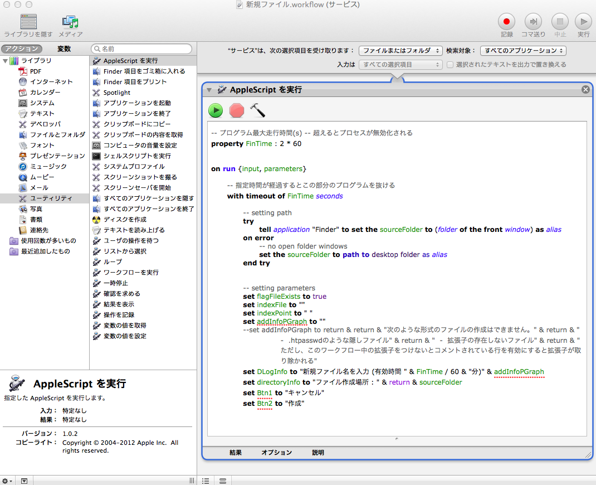

createNewFileWFlow
=================
`Finder.app`の右(副ボタン)クリックで新規フォルダは作成できるけれど、新規ファイルの作成ができなかったのでワークフローを作ってみました。  

    このワークフローは、ファイルまたはフォルダ上で右クリック時にのみ適応される。  
    ファイルの作成場所はファインダーのウィンドウが表示されている場合（Dockに格納されている場合も）、そのウィンドウが表示しているパスに保存される。  
    ウィンドウが表示されていない場合は、デスクトップ上に作成される。
### 追記 ###
-----------
* OS X 10.9 Marvericksで動作するかはわかりません

### 使い方 ###
-------------
* ディレクトリ`subRoutine`内の`divFileStrExt.app`をデスクトップに保存する ([divFileStrExt.app][sub])
	* `divFileStrExt.app`は、次の何れかの方法でデスクトップに保存する
		1. `ターミナル.app`のコマンド`git`でクローンを作成してクローン内のアプリケーションをコピペする
		2. [mainfApp.applescript][appsc]の内容を全体を選択してからコピーし、`AppleScriptエディタ.app`で新規ファイル内にペーストした後、保存時に名前を`divFileStrExt`拡張子を`.app`としてデスクトップに保存する。拡張子は、**選択欄**から選択して変更する。

* ディレクトリ`src`内の`main.applescript`の内容の**以下の部分を修正**する ([main.applescript][main])
	* `property fDivPath : `以降のパス指定を上記の関数プログラム`divFileStrExt.app`を置いた箇所までの絶対パスで記述する  
	* デスクトップ上に置いた場合は、以下のコード内の◯の部分のみだけ修正する

```applescript
property defaultFileName : "名称未設定"
property defaultExt : ".txt"

-- 拡張子切り出しプログラムの保存場所を変更した場合はこのパスも変更する
property fDivPath : "Macintosh HD:Users:◯◯◯◯◯:Desktop:divFileStrExt.app"

-- プログラム最大走行時間(s) -- 超えるとプロセスが無効化される
property FinTime : 2 * 60

(*
	省略
*)
```

* 修正した`main.applescript`の内容を全選択し、コピーする

* `Automator.app`を起動し、最初の画面で**サービス**を選択する。その後、右上にある選択欄で**「ファイルまたはフォルダ」**を選択する。次に、左側にある**「ライブラリ」**の中の**「ユーティリティ」**を選択し、右側に現れた**「AppleScriptを実行」**と書かれた項目を選択し、右側のスペースにドラッグ＆ドロップする。この中に先程コピーした`main.applescript`の内容をペーストする。次に、ハンマーのアイコンをクリックしてコンパイルを実行する。
  
**もしコンパイルが正しく実行されたら...**

* 名前を「新規ファイル」として保存する。`Finder.app`でファイルもしくはフォルダ上にカーソルがある状態で右クリックをすると「新規ファイル」という項目が現れているので新規ファイルを作成することができる。また、割り当てられていないショートカットを使う場合には、システム環境設定のキーボード設定でこのサービスのショートカットを作成できる。

### 保存場所 ###
---------------
* 上記の操作で作成された「新規ファイル.workflow」は隠しフォルダ内`/Users/ユーザ名/Library/Services/`に作成される。

[sub]: https://github.com/mickey305/ApplescriptWorkflow/tree/master/createNewFileWFlow/subRoutine
[main]: https://github.com/mickey305/ApplescriptWorkflow/blob/master/createNewFileWFlow/src/main.applescript
[appsc]: https://github.com/mickey305/ApplescriptWorkflow/blob/master/createNewFileWFlow/subRoutine/mainfApp.applescript